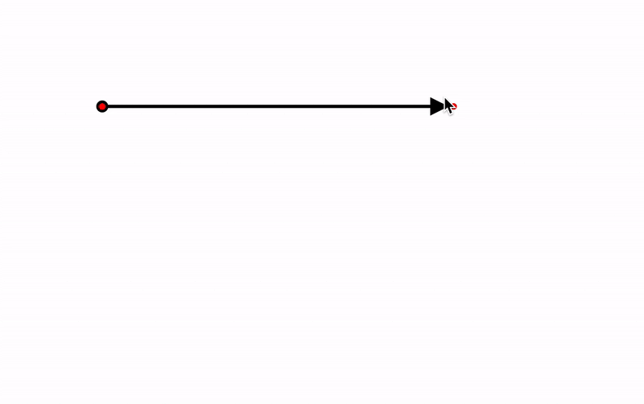

# Perfect Arrows

Um conjunto de funções para desenhar setas perfeitas entre pontos e formas.



👉 [Demonstração](https://perfect-arrows.now.sh/)

<div align="center">
<p>Outras línguas</p>
<p><a href="../README.md">Inglês (en)</a></p></div>

[](https://codesandbox.io/s/github/steveruizok/perfect-arrows/tree/master/example?fontsize=14&hidenavigation=1&theme=dark)

- [x] `getArrow` - Para setas ponto a ponto.
- [x] `getBoxToBoxArrow` - Para setas retângulo à retângulo.

## Instalação

```
npm i perfect-arrows
```

_ou_

```
yarn add perfect-arrows
```

## Modo de usar

As funções nesta biblioteca fornecem apenas as informações necessárias para desenhar uma seta. Você mesmo precisará desenhar a flecha usando a tecnologia de sua escolha. Veja abaixo um exemplo de componente React com SVG.

### `getArrow(x0, y0, x1, y1, options)`

A função `getArrow` aceita a posição de dois pontos e retorna uma matriz contendo informações para:

- três pontos: um ponto inicial, final e de controle
- três ângulos: fim, inicio e centro

Você pode usar essas informações para desenhar um arco e pontas de flecha. Você pode usar o objeto de opções para ajustar os valores de retorno.

```js
const arrow = getArrow(0, 0, 100, 200, {
  bow: 0,
  stretch: 0.5,
  stretchMin: 0,
  stretchMax: 420,
  padStart: 0,
  padEnd: 0,
  flip: false,
  straights: true,
})

const [sx, sy, cx, cy, ex, ey, ae, as, sc] = arrow
```

#### Argumentos

| Argumento | Tipo   | Descrição                                                                   |
| --------  | ------ | --------------------------------------------------------------------------- |
| `x0`      | number | A posição x do ponto inicial.                                               |
| `y0`      | number | A posição y do ponto inicial.                                               |
| `x1`      | number | A posição x do ponto final.                                                 |
| `y1`      | number | A posição y do ponto final.                                                 |
| options   | object | Um objeto (opcional) contendo uma ou mais das opções descritas abaixo.      |

#### Opções

| Opção       | Tipo    | Padrão | Descrição                                                                                                                                                    |
| ------------ | ------- | ------- | -------------------------------------------------------------------------------------------------------------------------------------------------------------- |
| `bow`        | number  | 0       | Um valor que representa o arco natural da flecha. Em `0`, todas as linhas serão retas.                                                                         |
| `stretch`    | number  | .5      | O efeito que o comprimento da flecha terá, em relação a seu `minStretch` e `maxStretch`, no arco da flecha. Em `0`, o alongamento não terá efeito. |
| `minStretch` | number  | 0       | O comprimento da seta onde a linha deve ser mais esticada. Distâncias menores do que essa não terão efeito adicional no arco da flecha.           |
| `maxStretch` | number  | 420     | O comprimento da flecha no qual o alongamento não deve ter efeito.                                                                                            |
| `padStart`   | number  | 0       | A distância que o ponto inicial da seta deve estar do ponto inicial fornecido.                                                                                    |
| `padEnd`     | number  | 0       | A distância que o ponto final da seta deve estar do ponto final fornecido.                                                                                        |
| `flip`       | boolean | false   | Se deve refletir o ângulo do arco da flecha.                                                                                                                      |
| `straights`  | boolean | true    | Se deve usar linhas retas em ângulos de 45 graus.                                                                                                             |

#### Retorno

| Argumento | Tipo   | Descrição                                                |
| --------  | ------ | -------------------------------------------------------- |
| `x0`      | number | A posição x do ponto inicial (preenchido).               |
| `y0`      | number | A posição y do ponto inicial (preenchido).               |
| `x1`      | number | A posição x do ponto final (preenchido).                 |
| `y1`      | number | A posição y do ponto final (preenchido).                 |
| `ae`      | number | O ângulo (em radianos) para uma ponta de seta final.     |
| `as`      | number | O ângulo (em radianos) para uma ponta de seta inicial.   |
| `ac`      | number | O ângulo (em radianos) para uma ponta de seta central.   |

## Exemplo: Um Componente React de seta

```jsx
import * as React from "react"
import { getArrow } from "perfect-arrows"

export function PerfectArrow() {
  const p1 = { x: 64, y: 64 }
  const p2 = { x: 128, y: 96 }

  const arrow = getArrow(p1.x, p1.y, p2.x, p2.y, {
    padEnd: 20,
  })

  const [sx, sy, cx, cy, ex, ey, ae, as, ec] = arrow

  const endAngleAsDegrees = ae * (180 / Math.PI)

  return (
    <svg
      viewBox="0 0 720 480"
      style={{ width: 720, height: 480 }}
      stroke="#000"
      fill="#000"
      strokeWidth={3}
    >
      <circle cx={sx} cy={sy} r={4} />
      <path d={`M${sx},${sy} Q${cx},${cy} ${ex},${ey}`} fill="none" />
      <polygon
        points="0,-6 12,0, 0,6"
        transform={`translate(${ex},${ey}) rotate(${endAngleAsDegrees})`}
      />
    </svg>
  )
}
```

### `getBoxToBoxArrow(x0, y0, w0, h0, x1, y1, w1, h1, options)`

A função `getBoxToBoxArrow` aceita a posição e as dimensões de duas caixas (ou retângulos) e retorna uma matriz contendo informações para:

- três pontos: um ponto inicial, final e de controle
- três ângulos: fim, inicio e centro

Você pode usar essas informações para desenhar um arco e pontas de flecha. Você pode usar o objeto de opções para ajustar os valores de retorno.

**Atenção:** As opções e valores retornados por `getBoxToBoxArrow` estão no mesmo formato que as opções e valores de `getArrow`.

```js
const arrow = getBoxToBoxArrow(0, 0, 96, 128, 400, 200, 128, 96, {
  bow: 0,
  stretch: 0.5,
  stretchMin: 0,
  stretchMax: 420,
  padStart: 0,
  padEnd: 0,
  flip: false,
  straights: true,
})

const [sx, sy, cx, cy, ex, ey, ae, as, sc] = arrow
```

#### Argumentos

| Argumento | Tipo   | Descrição                                                                   |
| --------  | ------ | --------------------------------------------------------------------------- |
| `x0`      | number | A posição x do primeiro retângulo.                                          |
| `y0`      | number | A posição y do primeiro retângulo.                                          |
| `w0`      | number | A largura do primeiro retângulo.                                            |
| `h0`      | number | A altura do primeiro retângulo.                                             |
| `x1`      | number | A posição x do segundo retângulo..                                          |
| `y1`      | number | A posição y do segundo retângulo..                                          |
| `w1`      | number | A largura do segundo retângulo.                                             |
| `h1`      | number | A altura do segundo retângulo.                                              |
| options   | object | Um objeto (opcional) contendo uma ou mais das opções descritas abaixo.      |

#### Opções

Veja as opções em `getArrow` acima. (Ambas as funções usam o mesmo objeto de opções.)

#### Retornos

Veja os retornos em  `getArrow` acima. (Ambas as funções retornam o mesmo conjunto de valores.)

## Exemplo: Um Componente React de seta retângulo à retângulo.

```jsx
import * as React from "react"
import { getBoxToBoxArrow } from "perfect-arrows"

export function PerfectArrow() {
  const p1 = { x: 64, y: 64, w: 64, h: 64 }
  const p2 = { x: 128, y: 96, w: 64, h: 64 }

  const arrow = getBoxToBoxArrow(
    p1.x,
    p1.y,
    p1.w,
    p1.h,
    p2.x,
    p2.y,
    p2.w,
    p2.h,
    {
      bow: 0.2,
      stretch: 0.5,
      stretchMin: 40,
      stretchMax: 420,
      padStart: 0,
      padEnd: 20,
      flip: false,
      straights: true,
    }
  )

  const [sx, sy, cx, cy, ex, ey, ae, as, ec] = arrow

  const endAngleAsDegrees = ae * (180 / Math.PI)

  return (
    <svg
      viewBox="0 0 1280 720"
      style={{ width: 1280, height: 720 }}
      stroke="#000"
      fill="#000"
      strokeWidth={3}
    >
      <circle cx={sx} cy={sy} r={4} />
      <path d={`M${sx},${sy} Q${cx},${cy} ${ex},${ey}`} fill="none" />
      <polygon
        points="0,-6 12,0, 0,6"
        transform={`translate(${ex},${ey}) rotate(${endAngleAsDegrees})`}
      />
    </svg>
  )
}
```

## Autor

[@steveruizok](https://twitter.com/steveruizok)
